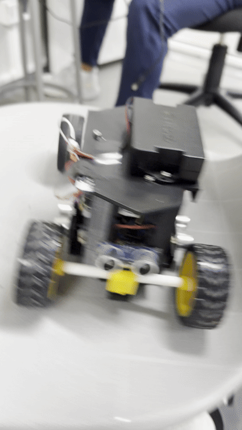

# Ingeniería de Materiales — WRO Future Engineers 2026

**TEAM VOLT** — Lima, Perú — WRO Future Engineers 2026

Este repositorio documenta todo el proceso de ingeniería detrás de **"Volt"**, nuestro vehículo autónomo para la competencia WRO Future Engineers 2026: desde los primeros prototipos de cada componente hasta el modelo y código final de competencia.

---

## Tabla de Contenidos

1. [El Equipo](#el-equipo)
2. [Resumen del Vehículo](#resumen-del-vehículo)
3. [Contenido del Repositorio](#contenido-del-repositorio)
4. [Del Prototipo al Modelo Final](#del-prototipo-al-modelo-final)
5. [Arquitectura de Hardware](#arquitectura-de-hardware)
6. [Arquitectura de Software](#arquitectura-de-software)
7. [Errores que Encontramos y Cómo los Resolvimos](#errores-que-encontramos-y-cómo-los-resolvimos)
8. [Videos de Rendimiento](#videos-de-rendimiento)
9. [Instrucciones de Armado](#instrucciones-de-armado)
10. [Créditos](#créditos)
11. [Mejoras Futuras Posibles](#mejoras-futuras-posibles)

---

## El Equipo

**TEAM VOLT**

| Miembro | Edad |
|---|---|
| Carlos Jorge Rojas Ruiz | 17 |
| Stephano Wan Rong | 18 |
| Aadidev Nappanveetil Akhilesh | 17 |

<table>
  <tr>
    <td align="center"><strong>Foto oficial</strong> </td>
    <td align="center"><strong>Foto del equipo</strong> </td>
  </tr>
</table>

---

## Resumen del Vehículo

"Volt" es un vehículo autónomo de cuatro ruedas, con tracción trasera y dirección delantera por servomotor, diseñado para navegar de forma completamente independiente un circuito de 3x3 metros, detectar y esquivar pilares de colores, y completar 3 vueltas de manera precisa y repetible, sin ninguna intervención humana.

El nombre "Volt" refleja la energía con la que el equipo abordó cada etapa: diseño mecánico, integración de sensores y programación del comportamiento autónomo.

**Dimensiones y peso** (dentro de las reglas de WRO 2026):
- Dimensiones máximas: 300 x 200 mm de planta, 300 mm de altura
- Peso total aproximado: bajo 1.5 kg

---

## Contenido del Repositorio

| Carpeta | Contenido |
|---|---|
| [`t-photos`](t-photos) | Fotos del equipo |
| [`v-photos`](v-photos) | Fotos del vehículo — prototipo y versión final, desde todos los lados |
| [`video`](video) | Enlaces a los videos de rendimiento en YouTube (Open y Obstacle Challenge) |
| [`schemes`](schemes) | Diagrama esquemático de los componentes electromecánicos y sus conexiones |
| [`src`](src) | Todo el código de control — desde prototipos individuales hasta el software final |
| [`models`](models) | Archivos STL para impresión 3D — chasis, ejes, soportes |
| [`material`](material) | Lista completa de materiales usados en el robot |

**Lee el README.md de cada carpeta para más detalle.**

---

## Del Prototipo al Modelo Final

Nuestro desarrollo fue iterativo: probamos cada componente por separado antes de integrarlo, y el chasis, el código y las fotos del vehículo pasaron por varias versiones hasta llegar al modelo final de competencia.

### Galería: Prototipo vs. Final

<table>
  <tr>
    <td align="center" colspan="2"><strong>Chasis</strong></td>
  </tr>
  <tr>
    <td align="center">Prototipo <em>(<a href="models/Prototype%20Chassis.stl">Prototype Chassis.stl</a>)</em></td>
    <td align="center">Final <em>(<a href="models/WRO%20Volt%20Chasis.stl">WRO Volt Chasis.stl</a>)</em></td>
  </tr>
  <tr>
    <td align="center"></td>
    <td align="center"></td>
  </tr>
  <tr>
    <td align="center"></td>
    <td align="center"></td>
  </tr>
  <tr>
    <td align="center"></td>
    <td align="center"></td>
  </tr>
  <tr>
    <td align="center"></td>
    <td align="center"></td>
  </tr>
</table>

### Línea de Tiempo del Desarrollo

| Etapa | Qué hicimos |
|---|---|
| **1. Pruebas de componentes individuales** ([`src`](src): `Prototype Motor Test`, `Prototype Ultrasonic Code`) | Código mínimo para confirmar que cada sensor y motor funcionaba por separado antes de integrarlo al resto del sistema. |
| **2. Primer código de conducción** ([`Prototype 3 Laps (Open Challenge) Code`](src/Prototype%203%20Laps%20%28Open%20Challenge%29%20Code)) | Primera versión capaz de dar vueltas completas al circuito, usada para probar la lógica de giro y de conteo de vueltas. |
| **3. Prueba de esquinas sin interferencia** (base de [`Final Open Challenge.ino`](src/Final%20Open%20Challenge.ino)) | Detectamos y arreglamos el problema de cross-talk entre los dos sensores ultrasónicos (ver sección de errores). |
| **4. Código Pre-Final** ([`Pre-Final Code 1`](src/Pre-Final%20Code%201)) | Integración de las correcciones anteriores en una versión más cercana a la de competencia. |
| **5. Código final — Open Challenge** ([`Final Open Challenge.ino`](src/Final%20Open%20Challenge.ino)) | Detección automática de dirección, cooldown entre esquinas y parada automática tras 12 esquinas (3 vueltas). |
| **6. Código final — Obstacle Challenge** ([`Final Obstacle Challenge.ino`](src/Final%20Obstacle%20Challenge.ino)) | Se añade la maniobra de salida de estacionamiento, detección de dirección por pared pegada, y evasión de pilares con pausa a media esquina para revisar la cámara. |

---

## Arquitectura de Hardware

### Controlador Principal

El cerebro del vehículo es un **Arduino Mega 2560**, elegido por su cantidad de pines digitales y su compatibilidad con las librerías de motores, servos y la cámara Sentry Vision 2.

### Sistema de Tracción

Motor **DC con caja reductora**, controlado por el driver **L298N**:

| Conexión | Pin |
|---|---|
| ENA (velocidad PWM) | 12 |
| IN1 | 11 |
| IN2 | 10 |
| VS (+) | Batería principal |
| GND | Tierra común |

### Sistema de Dirección

Servomotor **SG90** en el pin **9**, que mueve ambas ruedas delanteras mediante un varillaje mecánico. El servo se centra como primera operación absoluta en el `setup()` (con un delay de 1000ms) para evitar cualquier deriva al encender el vehículo.

| Ángulo | Open Challenge | Obstacle Challenge |
|---|:---:|:---:|
| Centro | 93° | 94° |
| Máximo izquierda | 46° | 46° |
| Máximo derecha | 140° | 140° |

### Sensores Ultrasónicos — HC-SR04

Usamos **dos sensores ultrasónicos**, uno a cada lado del vehículo, para detectar la apertura del corredor en cada esquina:

| Sensor | Trig | Echo |
|---|:---:|:---:|
| Izquierdo | 24 | 22 |
| Derecho | 50 | 52 |

El umbral de detección de esquina es **92 cm**: cuando la distancia lateral supera ese valor, el corredor interior se abrió y es momento de girar.

### Cámara de Visión — Sentry Vision 2 (Tosee Intelligence)

Comunicada por **I2C** (pines por defecto del Mega: SDA 20, SCL 21), detecta blobs de color entrenados para reconocer los pilares del Obstacle Challenge:

- **Label 13** → Pilar rojo → el robot lo pasa por la izquierda
- **Label 14** → Pilar verde → el robot lo pasa por la derecha

### Sistema de Alimentación

Una sola **batería Elegoo 2000mAh 7.4V**, distribuida por un riel de breadboard:

- Batería (+) → L298N VS y Arduino VIN
- Batería (−) → L298N GND y Arduino GND (tierra común)

El regulador interno del Arduino Mega convierte los 7.4V a 5V para los sensores.

Ver el diagrama completo en [`schemes/Circuit Final.png`](<schemes/Circuit%20Final.png>).

---

## Arquitectura de Software

Todo el software está escrito en **C++ para Arduino IDE** ([`src`](src)). Ambos programas finales comparten la misma base de lectura de sensores y control de motor, pero cada uno resuelve un desafío distinto.

### Final Open Challenge

[`Final Open Challenge.ino`](src/Final%20Open%20Challenge.ino) navega el circuito usando solo los dos sensores ultrasónicos:

- **Detección automática de dirección:** en la primera esquina detectada, el robot decide si el circuito es CW o CCW y desactiva el sensor opuesto por el resto de la carrera — evita giros incorrectos por lecturas cruzadas.
- **Giro por tiempo mínimo (875ms):** al detectar una esquina, el servo gira y se mantiene ese tiempo mínimo antes de volver a evaluar, evitando abandonar el giro por un falso positivo.
- **Cooldown de 1500ms** entre esquinas, para no re-detectar el mismo hueco dos veces.
- **Parada automática:** cuenta los giros (esquinas) completados; al llegar a **12** (3 vueltas × 4 esquinas), espera 900ms y se detiene por completo.

### Final Obstacle Challenge

[`Final Obstacle Challenge.ino`](src/Final%20Obstacle%20Challenge.ino) toma la misma base de navegación y agrega:

- **Detección de dirección al arrancar:** revisa qué pared está pegada al robot (< 10cm) para saber si debe salir del estacionamiento en sentido CW o CCW.
- **Maniobra de salida de estacionamiento:** secuencia de 3 fases (reversa, avance, avance lento) calibrada para cada sentido.
- **Esquinas con revisión de pilar a media vuelta:** el robot gira la primera mitad, se detiene 600ms para consultar la cámara, y según lo que detecta (pilar rojo, verde, o nada) completa el giro con una corrección distinta.
- **Ajuste en línea recta:** si detecta un pilar fuera de una esquina, hace un pequeño barrido de dirección para esquivarlo sin frenar.
- **Parada automática:** igual que el Open Challenge, cuenta esquinas y se detiene tras 12, con 500ms de espera.

---

## Errores que Encontramos y Cómo los Resolvimos

### 1. Interferencia (cross-talk) entre los sensores ultrasónicos

Al hacer sonar los dos sensores HC-SR04 seguidos, uno captaba el eco del otro, produciendo una lectura falsa de ~57cm justo en el hueco que debía activar el giro — el robot no doblaba cuando debía. **Solución:** una vez que la dirección del circuito queda fijada, el sensor opuesto se desactiva por completo y solo se lee el sensor del lado activo, eliminando la interferencia.

### 2. El conteo de vueltas por sensor de color resultó innecesario

Durante el desarrollo probamos y calibramos un sensor de color **TCS3200** (ver [`material`](material)) para contar las líneas naranjas del circuito y así saber cuándo detenerse. En la versión final decidimos reemplazar ese método: contar directamente las esquinas detectadas por los sensores ultrasónicos (12 esquinas = 3 vueltas) es más simple, no depende de la calibración de color bajo distintas luces, y usa un sensor que el robot ya necesitaba de todas formas.

### 3. Varias iteraciones de chasis antes del diseño final

Probamos e imprimimos varias piezas de chasis descargadas y modificadas antes de definir el diseño propio. Los archivos de esas iteraciones descartadas fueron eliminados del repositorio y solo se conservan el [`Prototype Chassis.stl`](models/Prototype%20Chassis.stl) y el diseño final, [`WRO Volt Chasis.stl`](models/WRO%20Volt%20Chasis.stl).

### 4. Lista de materiales incorrecta

La primera versión de nuestra lista de materiales ([`material`](material)) tenía componentes que en realidad no usamos (batería LiPo genérica, portapilas 18650, indicador de voltaje LED, sistema Ackermann como ítem aparte). La corregimos para reflejar exactamente lo que lleva "Volt": batería Elegoo 2000mAh 7.4V, chasis impreso en 3D, ruedas, protoboard e interruptor.

### 5. Recalibración de ángulos del servo

Entre versiones intermedias y la final ajustamos el centro del servo (de 90° a 93°/94° según el desafío) y el ángulo máximo hacia la izquierda (de 40° a 46°) para corregir una leve asimetría en el varillaje de dirección detectada durante las pruebas físicas.

---

## Videos de Rendimiento

| Desafío | Video |
|---|---|
| Open Challenge | [Ver en YouTube](https://www.youtube.com/shorts/3S9T03eFTFk) |
| Obstacle Challenge | [Ver en YouTube](https://www.youtube.com/watch?v=1XT1xbffeuU) |

Más detalles en [`video/README.md`](video/README.md).

---

## Instrucciones de Armado

1. **Lista de materiales** — reúne todos los componentes antes de empezar: [`material/`](material)
2. **Impresión 3D** — imprime las piezas del chasis y soportes con cualquier impresora compatible con STL: [`models/`](models)
3. **Conexiones eléctricas** — sigue el diagrama esquemático para las conexiones entre Arduino, driver, sensores y batería: [`schemes/Circuit Final.png`](<schemes/Circuit%20Final.png>)
4. **Cargar el código** — sube [`Final Open Challenge.ino`](src/Final%20Open%20Challenge.ino) o [`Final Obstacle Challenge.ino`](src/Final%20Obstacle%20Challenge.ino) según el desafío, usando Arduino IDE con las librerías `Servo.h`, `Wire.h` y `Sentry.h` (esta última de Tosee Intelligence).

---

## Créditos

- **Chasis:** basado en [Simple Arduino RC CAR](https://www.thingiverse.com/thing:6667669) por **T_Lab** (Thingiverse, junio 2024), usado como referencia y modificado para adaptarlo a los componentes y dimensiones de "Volt". Ver [`models/README.md`](models/README.md#créditos).

---

## Mejoras Futuras Posibles

- **Distancia lateral con más de un sensor por lado:** un segundo sensor por lado ayudaría a confirmar esquinas y reducir falsos positivos sin depender solo del cooldown por tiempo.
- **Encoder en el motor de tracción:** permitiría medir distancia recorrida real en vez de depender únicamente de tiempos fijos de giro.
- **PCB en vez de breadboard:** reduciría el riesgo de cables sueltos y mejoraría la fiabilidad de las conexiones durante el transporte y la competencia.
- **Rangos de color dinámicos:** si en el futuro se retoma el sensor de color, ajustar los umbrales de detección automáticamente según la luz ambiental lo haría más confiable entre distintos escenarios.

---

*Desarrollado por TEAM VOLT — WRO Future Engineers 2026 — Lima, Perú*
